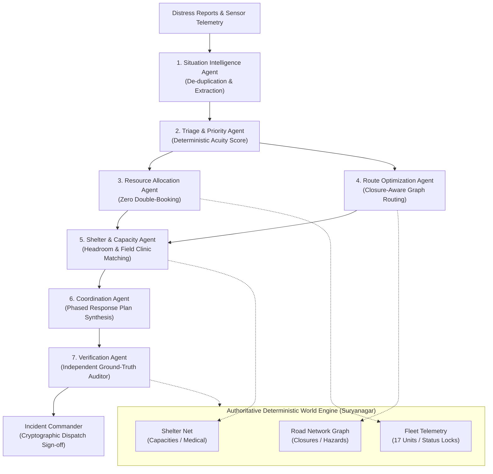

# RESQ | Intelligent Disaster Response Coordination Platform

> **SIMULATION MODE ACTIVE**  
> Fictional Geography: Suryanagar, India. Decision-support and multi-agent coordination platform; not a replacement for statutory emergency authorities.

---

## 1. Product Identity & Proposition

**RESQ** transforms fragmented disaster information into verified, coordinated emergency response plans using specialized AI agents, real-time operational data, and human-controlled dispatch.

* **Primary Headline:** Coordinate the response. Not just the information.
* **Supporting Proposition:** RESQ connects incident intelligence, resource availability, route planning, shelter capacity, and verified response workflows in one operational environment.
* **Authoritative World Engine:** The LLM does not hallucinate resources, road conditions, or shelter counts. All mutations pass through validated domain services.
* **The Pivotal Demo Moment:** A rescue team is assigned. A route becomes blocked. RESQ detects that the original plan is no longer valid, coordinates the necessary agents, finds an alternative bypass, verifies the new allocation against ground-truth data, and requests the Incident Commander to approve the updated response.

---

## 2. Multi-Agent Architecture



---

## 3. The Seven Specialized Agents

1. **Situation Intelligence Agent:** Ingests raw emergency call transcripts and citizen messages, de-duplicates related incoming reports, extracts structured disaster parameters.
2. **Triage and Priority Agent:** Analyzes structured incident attributes, evaluates life-threat criteria, calculates deterministic priority score (0-100), and assigns urgency windows.
3. **Resource Allocation Agent:** Inspects live resource inventory via database tools, matches capabilities, checks distance and travel time, enforces strict double-booking prevention.
4. **Route Optimization Agent:** Queries graph routing engine for safest and fastest path from resource base to incident scene. Evaluates road closures and hazard zones.
5. **Shelter and Capacity Agent:** Inspects live shelter network, verifies headroom capacity, checks medical facility presence for casualties, power backup, and food/water supplies.
6. **Coordination Agent:** Synthesizes the outputs into a unified, actionable, versioned Response Plan (`DRAFT`).
7. **Verification Agent:** Independent ground-truth auditor. Validates zero duplicate bookings, road clearance, and shelter headroom before presenting to Commander.

---

## 4. Supported Disaster Scenarios (Suryanagar, India)

1. **Flood:** Riverine dam surge, submerged roads (`RS-01` / `RS-09`), rescue boats, evacuation to South Stadium, and medical access.
2. **Cyclone:** Very Severe Cyclonic Storm 'Varuna', coastal esplanade surge, high-tension transmission pylon collapse on `RS-02`.
3. **Earthquake:** Intraplate magnitude 6.4 seismic event, Old Town commercial arcade collapse, rubble obstruction on `RS-03`, USAR acoustic search.
4. **Wildfire:** Northern ridge wildland-urban interface firestorm, 55 km/h gusts, smoke hazard corridor on `RS-04`, water tenders.
5. **Landslide:** Torrential cloudburst slope failure, `RS-05` Ghat Road rockfall severance, isolated vehicles, western bypass rerouting.

---

## 5. Eleven Functional Modules

1. **Command Center:** Central operational dashboard with MapLibre GIS map, priority triage queue, live alerts, and quick controls.
2. **Incident Intelligence:** Distress call transcript ingestion, AI entity extraction, de-duplication, and acuity calculations.
3. **Resource Command:** 17-unit fleet registry across 12 resource categories with live telemetry, fuel, and status locks.
4. **Shelter Network:** Municipal shelter network with real-time occupancy headroom trackers, clinic flags, and intake actions.
5. **Agent Observatory:** Interactive React Flow topology diagram, execution traces, latency (ms), tokens, and decision reasoning.
6. **Response Plan Management:** Full lifecycle governance (Draft -> Verified -> Awaiting Approval -> Dispatched -> Replanning -> Completed).
7. **Simulation Control:** Clock control (Start, Pause, Resume, Reset, 1x/2x/5x), tick progression, and hazard injection.
8. **Audit & Decision History:** Immutable audit log tracking actors, timestamps, state diffs, and cryptographic sign-offs.
9. **Alert Center:** Real-time broadcast warnings with acknowledgment workflow.
10. **User & Role Management:** Role-Based Access Control (Viewer, Operator, Incident Commander, Administrator) with demo switcher.
11. **System Settings:** Google Gemini API configuration, health status, and authoritative database reset.

---

## 6. Judge & Technical Evaluator Demonstration Script

Follow these steps to experience the complete platform flow:

1. **Launch the Public Landing Page:**  
   Open `http://localhost:5173/` to view the public product website, architecture pillars, and legal links.
2. **Enter the Command Center:**  
   Click **"Explore the Command Center"** (`/command`).
3. **Select a Scenario & Run Multi-Agent Planning:**  
   In the **Incident Priority Triage Queue**, locate the critical incident (*"Submerged Residential Ward - 28 Citizens Stranded"*). Click **"Run Agents"**.
4. **Observe the Agent Observatory (`/command/agents`):**  
   Watch the 7 agents execute in sequence on the React Flow graph. Inspect the structured output and decision explanation.
5. **Authorize Dispatch:**  
   In the **Active Response Plans** card, click **"Review & Approve Dispatch"**. Inspect the Verification Agent's 100/100 score and checklist. Ensure the active role is **Commander** (top right header) and click **"Authorize Emergency Dispatch"**.
6. **Experience Continuous Replanning (The Core Agentic Moment):**  
   * Click the red **"Inject Hazard"** button.
   * Select road segment `RS-09` (River Bridge Causeway) and click **"Inject Obstruction Now"**.
   * Notice that RESQ immediately invalidates the original plan, flags the route as severed, triggers the Route and Verification agents, calculates a safe bypass via `RS-03` + `RS-01`, and presents the rerouted plan (`v2`) for Commander re-approval!
7. **Inspect Audit History (`/command/audit`):**  
   Review the immutable log showing `ROUTE_INVALIDATED_AND_REPLANNED` with exact timestamps and bypassed coordinates.

---

## 7. Quickstart (Local Development)

### Prerequisites
* Python 3.10+
* Node.js 18+ and npm

### Backend Setup
```bash
# 1. Navigate to backend directory
cd backend

# 2. Activate virtual environment or create one
python -m venv venv
.\venv\Scripts\activate   # On Windows
# source venv/bin/activate # On Linux/macOS

# 3. Install dependencies
pip install -r requirements.txt

# 4. Run automated test suite
pytest tests/test_system.py -p no:asyncio -v

# 5. Start FastAPI development server
uvicorn app.main:app --reload --host 127.0.0.1 --port 8000
```

### Frontend Setup
```bash
# 1. Navigate to frontend directory
cd frontend

# 2. Install dependencies
npm install

# 3. Start Vite development server
npm run dev
```

Visit `http://localhost:5173/` in your browser.

---

## 8. Production Docker Deployment

Deploy the entire multi-container stack (PostgreSQL + FastAPI + Nginx Frontend) with one command:

```bash
docker-compose up --build -d
```
* **Frontend:** `http://localhost:3000`
* **Backend API & Docs:** `http://localhost:8000/docs`
* **Health Check:** `http://localhost:8000/health`
